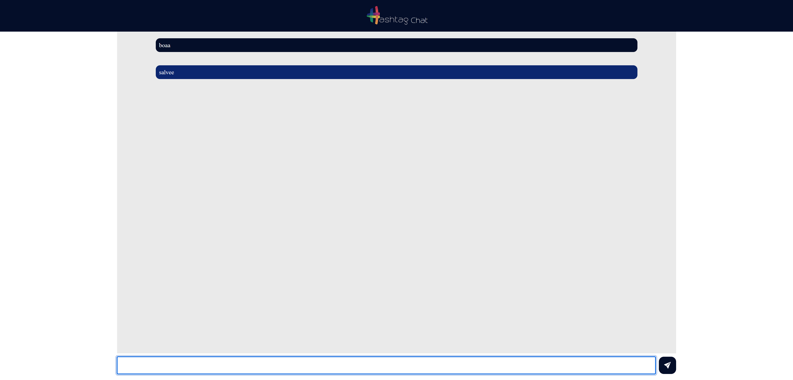

# Projeto Aula 04 - Intensivão JavaScript 2024
Chat em tempo real

<h1 align="center">
  
</h1>


## 💻 Tecnologias Utilizadas nesse Projeto
<div style="display: inline_block">
  
  
  
  
  
  
</div>

<br>

## Especificações
- Node: 20.10.0
- Pacote de Gerenciamento de Dependências: NPM
- Framework: Express

<br>

## Como instalar as dependências
```bash
$ npm install
```

<br>

## Rodar o Frontend
```bash
$ npm run start
```

<br>

## Link do Deploy
https://hashtaurante.vercel.app/